# UpUpOS


# 操作系统课程设计文档


## 小组成员

+ 1953981 吴昊天
+ 1954090 刘心宇

+ 

+ 


## 目录

+ [1. 项目概述](#1-项目概述 )

+ [2. 系统使用说明](#2-系统使用说明)

+ [3. 系统功能实现](#3-系统功能实现)


## 1. 项目概述


### 1.1 项目介绍

### 1.2 项目开发环境

### 1.3 项目完成进展

### 1.4 小组分工


## 2. 系统使用说明


### 2.1 安装环境

### 2.2 开机运行

### 2.3 系统引导程序

### 2.4 系统级应用


#### 2.4.1 文件管理

#### 2.4.2 进程管理

​        进程管理processmanager，主要实现系统中进程的显示、启动、关闭、调度与保护，采用优先级调度方法。

###### 进入进程管理应用——process；显示所有进程——ps

​        依次打印出每个进程显示出进程并且下方给出指令提示：

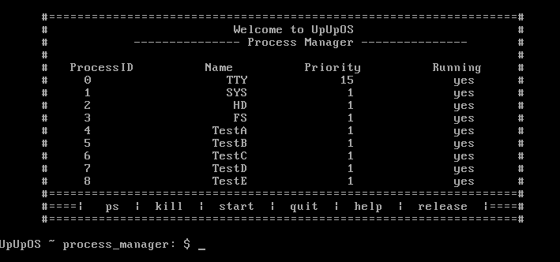

###### 关闭进程——kill [ProcessID]

​        关闭进程成功:

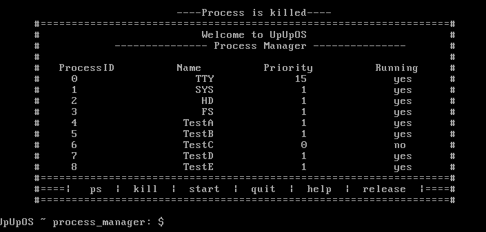

​        禁止关闭:

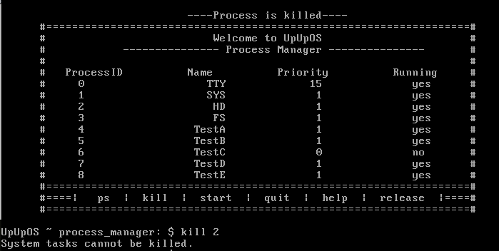

​        进程已经关闭:

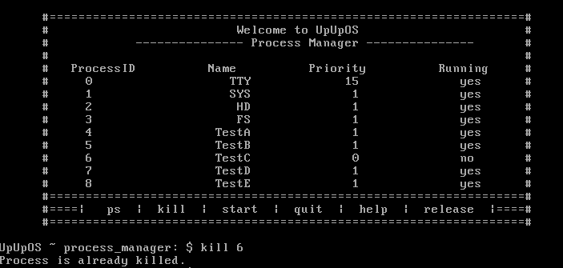

​        ProcessID非法:

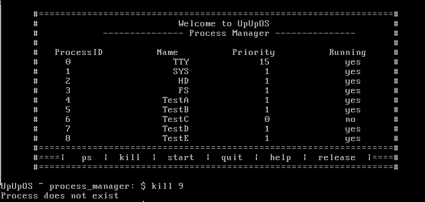

###### 启动进程——start [ProcessID]

​        启动进程成功:

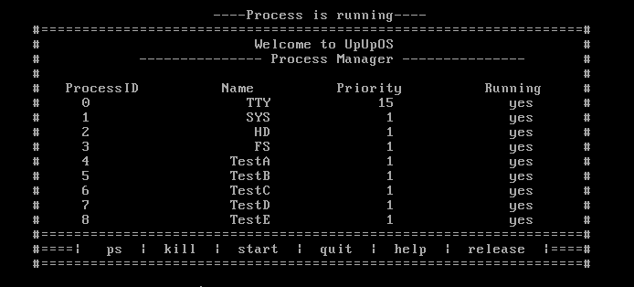

​        进程已经启动:

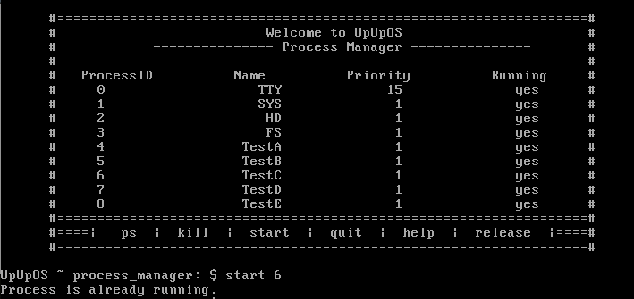

​        ProcessID非法:

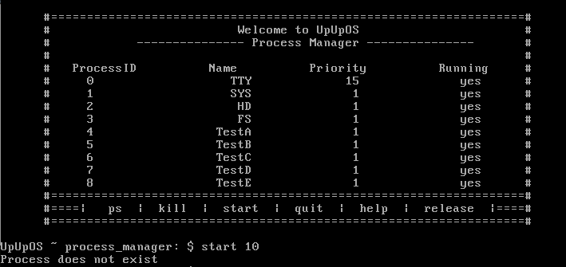

###### 释放空闲进程——release

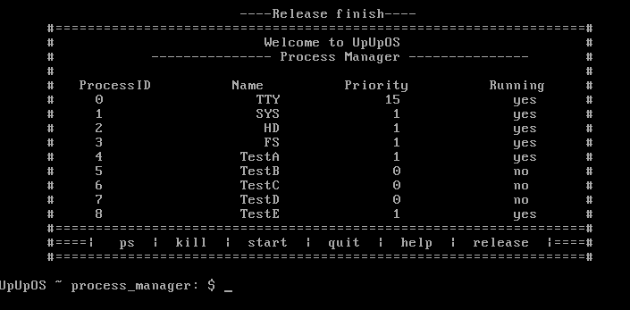

###### 帮助界面——help

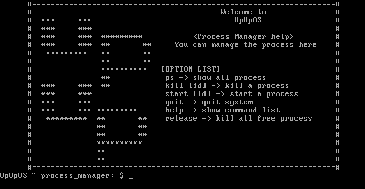

#### 2.4.3 系统引导程序

### 2.5 用户级应用


#### 2.5.1 应用

+ **日历**

   ​        本应用实现了查看日期的日历功能，包括月份的显示，常见阳历节日展示，以年或月为单位进行跳转显示，显示某一天的详情信息等功能。

   ######  功能展示

   ​        显示当前月份日历以及当月节日——cal:

   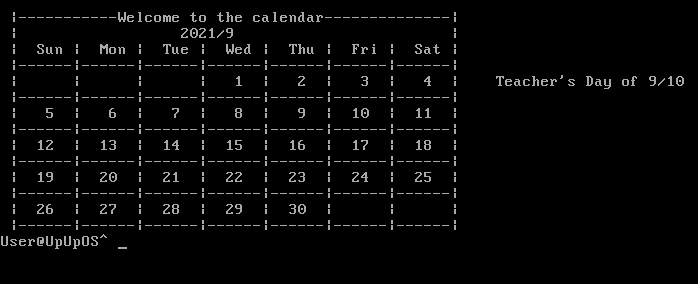

   ​        跳转至某年——cal -y 2016:

   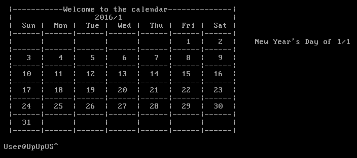

   ​        跳转至某年某月——cal -m 2018/10:

   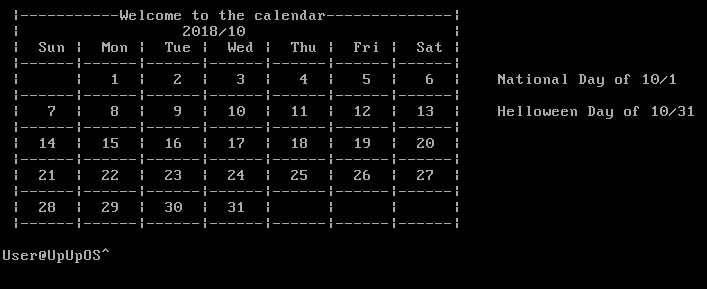

   ​        显示某天信息并跳转到对应月份——cal -d 2019/12/25

   ​        包括这一天的星期、是一年中的第几天和节日信息:

   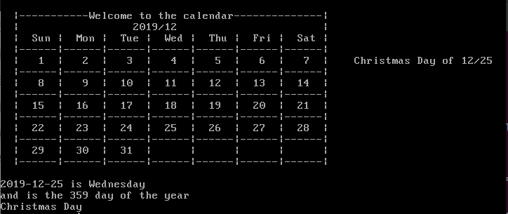

   ​        向后(前)跳转一月(当前日期2021/9)——cal -next(pre):

   

   ​        向后(前)跳转一年(当前日期2021/9)——cal -next(pre)-y:

   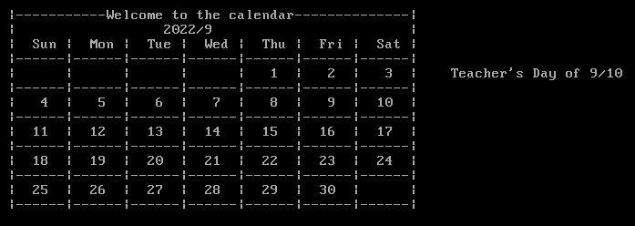

   ​       错误日期提示——cal -d 2020/10/30:

   

   

+ **四则计算器**

#### 2.5.2 游戏

+ **Color Ball**

  ​        实现了经典游戏五子连珠(color ball)，用户可以通过输入坐标移动棋子，进行游戏。

  ###### 游戏规则

            1. 棋盘大小为9X9，共有7种不同的棋子.
            2. 玩家每次可以移动一个棋子的位置.
            3. 目标位置必须为空，并且要移动的棋子到目标处必须有路径(上下左右斜侧8个方向)可走.
            4. 每当玩家移动棋子后，棋盘随机在三个位置生成三个随机棋子.
            5. 每当横竖或斜向组成5个及以上同色棋子时，棋子消除，消除5个棋子得10分，在此基础上每多一个额外加2分，并且能够额外获得一次移动棋子的机会.
            6. 当所有棋盘都被棋子填满后游戏结束，给出得分

  ###### 功能展示

  ​        进入游戏，选择初始棋子数——game -colorball:

  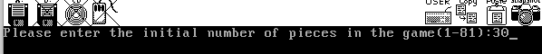

  ​        根据提示输入坐标便可移动棋子:

  

  ​        棋盘占满或者输入q时结束游戏:

  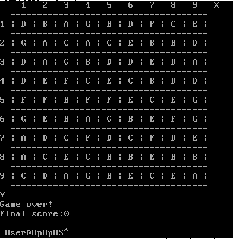

+ **国际跳棋**

+ **经典扫雷**

+ **五子棋**

## 3. 系统功能实现

### 3.1 系统级应用


#### 3.1.1 文件管理

#### 3.1.2 进程管理

源码路径:kernel\application\processmanager.c

###### 源码说明

| 函数名称         | 返回值类型 | 函数参数     | 作用         |
| ---------------- | ---------- | ------------ | ------------ |
| showPs           | void       | NULL         | 打印所有进程 |
| showHelp         | void       | NULL         | 打印帮助界面 |
| killProcess      | void       | int pid      | 结束进程     |
| startProcess     | void       | int pid      | 启动进程     |
| release          | void       | NULL         | 释放空闲进程 |
| runProcessManage | void       | int fd_stdin | 进程主函数   |

###### 部分代码示例

```c
void runProcessManage(int fd_stdin);
void showPs();
void showHelp();
void killProcess(int pid);
void startProcess(int pid);
void release();
```


#### 3.1.3 系统引导程序

### 3.2 用户级应用


#### 3.2.1 应用

+ **日历**

  源码路径:kernel\application\calendar.c

  ###### 源码说明

  | 函数名称   | 返回值类型 | 函数参数                                      | 作用                   |
  | ---------- | ---------- | --------------------------------------------- | ---------------------- |
  | leapYear   | int        | int year                                      | 闰年判断               |
  | monthDay   | int        | int year, int month                           | 返回月份日期数         |
  | countDay   | int        | int year, int month, int day                  | 计算日期是一年的第几天 |
  | Weekday    | int        | int year, int month, int day                  | 返回星期信息           |
  | festival   | int        | int month, int day                            | 判断是否为节日并输出   |
  | printMonth | void       | int year, int month                           | 打印日历               |
  | printDay   | void       | int year, int month,int day                   | 输出某一天的信息       |
  | calendar   | void       | char* option, int* year, int *month, int *day | 进程主函数             |

  ###### 部分代码示例

  ```c
  int leapYear(int year)
  {
  	if ((year % 400 == 0) || ((year % 4 == 0) && (year % 100 != 0)))
  		return 1;
  	else
  		return 0;
  }
  int monthDay(int year, int month);
  int countDay(int year, int month, int day)
  {
  	int sum = 0;
  	int i = 1;
  	for (i = 1; i < month; i++)
  		sum = sum + monthDay(year, i);
  	sum = sum + day;
  	return sum;
  }
  int Weekday(int year, int month, int day)
  {
      int count;
      count = (year - 1) + (year - 1) / 4 - (year - 1) / 100 + (year - 1) / \
          400 + countDay(year, month, day);
      count = count % 7;
      return count;
  }
  int festival(int month, int day);
  void printWeek(int year, int month, int day);
  void printMonth(int year, int month);
  void printDay(int year, int month,int day);
  void calendar(char* option, int* year, int *month, int *day);
  
  ```

  

+ **四则计算器**

#### 3.2.2 游戏

+ **Color Ball**

  源码路径:kernel\game\colorball.c

  ###### 源码说明

  | 数据结构名称       | 数据结构内容             | 作用                                       |
  | ------------------ | ------------------------ | ------------------------------------------ |
  | struct zhu         | int colour，int x，int y | 代表棋子结构体，变量分别代表颜色、横纵坐标 |
  | struct zhu* pp[81] | zhu*                     | 指向棋盘空的位置的指针组                   |

  | 函数名称   | 返回值类型 | 函数参数                                            | 作用                         |
  | ---------- | ---------- | --------------------------------------------------- | ---------------------------- |
  | enQueue    | int        | struct zhu *a, int front, int rear, struct zhu data | 棋子结构体入队列函数         |
  | empty      | int        | struct zhu* a, int front, int rear                  | 队列判空函数                 |
  | MAP        | int        | NULL                                                | 初始化函数                   |
  | randomin   | int        | int n                                               | 随机产生n个珠子              |
  | judge      | int        | int x, int y, int ifauto                            | 判断是否组成五个及以上的棋子 |
  | zhudelete  | void       | struct zhu *temp                                    | 删除棋子                     |
  | move       | void       | int inx, int iny, int tox, int toy                  | 移动棋子                     |
  | coutmap    | void       | NULL                                                | 输出棋盘                     |
  | coutscore  | void       | NULL                                                | 输出分数                     |
  | readnumber | int        | NULL                                                | 获取初始棋子数               |
  | findpath   | int        | int inx, int iny, int tox, int toy                  | 判断路径是否可行             |
  | iffine     | int        | int inx, int iny, int tox, int toy                  | 判断输入是否合法             |
  | colorBall  | int        | fd_stdin                                            | 进程主函数                   |

  ###### 部分代码示例

  ```c
  #define DELAY_TIME 3000 //延迟时间
  #define NULL ((void *)0)
  #define max 81//表示顺序表申请的空间大小
  
  
  struct zhu //棋子结构体，包括颜色信息和坐标信息
  {
  	int colour; //0代表空，1 - 7代表各种颜色
  	int x; //横坐标
  	int y; //纵坐标
  };
  int loop = 0;
  struct zhu map[9][9]; //游戏棋盘
  struct zhu* pp[81]; //指向棋盘空的位置的指针组
  int score; //分数
  int mark[9][9]; //记录寻找路径时该位置是否走过
  int number; //记录棋盘上空的个数
  
  int enQueue(struct zhu *a, int front, int rear, struct zhu data);
  int empty(struct zhu* a, int front, int rear);
  int MAP(); //初始化函数
  int randomin(int n); //随机产生n个珠子
  int judge(int x, int y, int ifauto); //以一个棋子为中心判断是否组成五个及以上的棋子，ifauto用于区分是随机生成还是玩家移动
  void zhudelete(struct zhu *temp);//删除棋子
  void move(int inx, int iny, int tox, int toy); //移动棋子，参数依次是初始位置，目标位置
  void coutmap(); //输出棋盘
  void coutscore(); //输出分数
  int readnumber(); //外部读取nember的数值
  int findpath(int inx, int iny, int tox, int toy); //判断路径是否可行
  int iffine(int inx, int iny, int tox, int toy); //判断输入是否合法
  
  ```

  

+ **国际跳棋**

+ **经典扫雷**

+ **五子棋**


