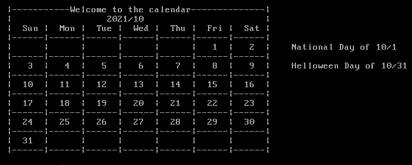
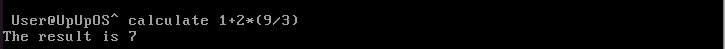
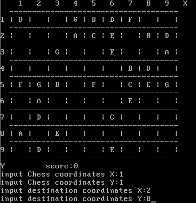

# UpUpOS


# 操作系统课程设计文档


## 小组成员

+ [Wizard23333](https://github.com/Wizard23333)
+ [MetorSage](https://github.com/MetorSage)

+ [511tony](https://github.com/511tony)

+ [wangxiaomie](https://github.com/wangxiaomie)

## 目录

+ [1. 项目概述](#1-项目概述 )

  + [1.1 项目介绍](#11-项目介绍)
  + [1.2 项目开发环境](#12-项目开发环境)
  + [1.3 项目完成进展](#13-项目完成进展)
  + [1.4 小组分工](#14-小组分工)

+ [2. 系统使用说明](#2-系统使用说明)

  + [2.1 安装环境](#21-安装环境)
  + [2.2 开机运行](#22-开机运行)
  + [2.3 系统引导程序](#23-系统引导程序)
  + [2.4 系统级应用](#24-系统级应用)
    + [2.4.1 文件管理](#241-文件管理)
    + [2.4.2 进程管理](#242-进程管理)
    + [2.4.3 系统引导程序](#243-系统引导程序)
  + [2.5 用户级应用](#25-用户级应用)
    + [2.5.1 应用](#251-应用)
    + [2.5.2 游戏](#252-游戏)

+ [3. 系统功能实现](#3-系统功能实现)

  + [3.1 系统级应用](#31-系统级应用)

    + [3.1.1 文件管理](#311-文件管理)
    + [3.1.2 进程管理](#312-进程管理)
    + [3.1.3 系统引导程序](#313-系统引导程序)

  + [3.2 用户级应用](#32-用户级应用)

    + [3.2.1 应用](#321-应用)
    + [3.2.2 游戏](#322-游戏)

    

## 1. 项目概述


### 1.1 项目介绍

本操作系统项目使用《Orange'S：一个操作系统的实现》中给出的第`9`章第`j`份源码为基础，在其上实现了一个简单的操作系统，本操作系统实现了3个系统级应用：系统引导程序，文件管理系统和进程管理系统；实现了7个用户级应用，其中包括2个应用：日历，四则计算器，5个系统小游戏：五子连珠，国际跳棋，五子棋，扫雷，数独游戏。

除此之外，系统还配备有命令行式的操作主界面，其上显示有可以使用的命令，便于初次使用的人员操作。

### 1.2 项目开发环境

+ 编程语言：C，makefile
+ 开发环境：
  + 虚拟机：VMware Workstation 15 / VMware Fusion 12.1.2
  + Linux版本：Ubuntu 20.04.2.0
  + bochs版本：2.9.6

### 1.3 项目完成进展

+ 2020.08.06 开始阅读项目要求，确定项目整体完成内容
+ 2020.08.10 安装虚拟机以及bochs，对书中源码进行初步测试
+ 2020.08.12 阅读《Orange'S：一个操作系统的实现》对书中章节和源代码进行学习分析，了解各部分运作原理
+ 2020.08.17 建立项目仓库，以书中给出源码第`9`章第`j`份为项目初始代码，在其上迭代
+ 2020.08.29 基本完成整体项目

### 1.4 小组分工

+ #### [Wizard23333](https://github.com/Wizard23333)

  + 项目环境搭建
  + 项目仓库建立
  + 整体框架选择搭建
  + 系统整体界面
  + 系统引导程序
  + 国际跳棋游戏

+ #### [MetorSage](https://github.com/MetorSage)

  + 进程管理系统
  + 五子连珠游戏
  + 日历应用
  + 项目文档
  + 系统标志设计

+ #### [wangxiaomie](https://github.com/wangxiaomie)
  
  + 经典扫雷游戏
  + 数独游戏
  + 项目文档
  
+ #### [511tony](https://github.com/511tony)

  + 四则计算器
  + 五子棋游戏
  + 文件管理系统
  + 项目文档


## 2. 系统使用说明

### 2.1 安装环境

#### 2.1.1 虚拟机运行软件

+ Windows请选择VMware
+ macOS请选择VMware Fusion/Paralles Desktop

#### 2.1.2 Linux版本

本项目使用的Linux版本为Ubuntu 20.04.2.0和Ubuntu 20.04.1.0，未对其他版本进行测试，请按需选择Linux版本

#### 2.1.3 bochs 安装流程

+ 安装依赖插件

  ```shell
  sudo apt-get install build-essential
  sudo apt-get install xorg-dev
  sudo apt-get install bison
  sudo apt-get install libgtk2.0-dev
  sudo apt-get install nasm
  ```

+ 安装bochs

  + 下载bochs：[bochs-2.6.9.tar.gz](https://sourceforge.net/projects/bochs/files/bochs/)

  + 解压下载的压缩包

  + 运行运行configure脚本

    ```shell
    sudo ./configure --enable-debugger --enable-disasm
    ```

  + 运行makefile

    ```shell
    make clean
    sudo make
    ```

  + 安装

    ```shell
    sudo make install 
    ```

#### 2.1.4 编译UpUpOS项目

+ 进入UpUpOS的项目目录

+ 运行命令

  ```shell
  make image
  ```

### 2.2 开机运行

+ 修改bochsrc的BIOS路径为自己的BIOS路径

  

+ 进入到UpUpOS的项目目录

+ 输入指令

  ```shell
  bochs
  ```

  或

  ```shell
  bochs -f bochsrc
  ```

+ 输入c

+ 退出系统

  在终端中使用`control`+`c` 和 `control`+`d`

### 2.3 系统引导程序

+ 系统引导程序，便于初次使用的用户来使用该操作系统，通过在主菜单输入`systemguide`命令进入

  

+ 输入`1`进入显示UpUpOS的基本使用信息，按任意键退出

  
  
+ 输入`2`进入系统游戏菜单，可以选择一个游戏运行

  

+ 输入`3`进入应用菜单，可以选择一个系统应用运行

  

+ 输入`4`进入系统信息菜单

  

### 2.4 系统级应用

#### 2.4.1 文件管理

​        输入help文件管理系统界面


输入ls列出当前文件列表


输入create +文件名 创建新文件


输入rm +文件名 删除文件


输入 mkdir+ 文件夹名 创建文件夹


输入write +文件名+内容 写文件 

输入read+文件名 读文件


#### 2.4.2 进程管理

​        进程管理processmanager，主要实现系统中进程的显示、启动、关闭、调度与保护，采用优先级调度方法。

**进入进程管理应用——process；显示所有进程——ps**

​        依次打印出每个进程显示出进程并且下方给出指令提示：


**关闭进程——kill [ProcessID]**

​        关闭进程成功:


​        禁止关闭:


​        进程已经关闭:


​        ProcessID非法:


**启动进程——start [ProcessID]**

​        启动进程成功:


​        进程已经启动:


​        ProcessID非法:


**释放空闲进程——release**


**帮助界面——help**


#### 2.4.3 系统引导程序

此处与2.3保持一致

点击跳转到[2.3](#23-系统引导程序)

### 2.5 用户级应用


#### 2.5.1 应用

+ **日历**

   ​        本应用实现了查看日期的日历功能，包括月份的显示，常见阳历节日展示，以年或月为单位进行跳转显示，显示某一天的详情信息等功能。

   **功能展示**

   ​        显示当前月份日历以及当月节日——cal:

   

   ​        跳转至某年——cal -y 2016:

   

   ​        跳转至某年某月——cal -m 2018/10:

   

   ​        显示某天信息并跳转到对应月份——cal -d 2019/12/25

   ​        包括这一天的星期、是一年中的第几天和节日信息:

   

   ​        向后(前)跳转一月(当前日期2021/9)——cal -next(pre):

   

   ​        向后(前)跳转一年(当前日期2021/9)——cal -next(pre)-y:

   

   ​       错误日期提示——cal -d 2020/10/30:

   

   

+ **四则计算器**

   本应用实现对数字简单的加减乘除运算，并对错误输入有反馈，让程序不会异常退出。

     **功能展示**

     正常计算

     

     异常提示

     

     帮助界面

     

#### 2.5.2 游戏

**Color Ball**

​        实现了经典游戏五子连珠(color ball)，用户可以通过输入坐标移动棋子，进行游戏。

**游戏规则**

1. 棋盘大小为9X9，共有7种不同的棋子.
2. 玩家每次可以移动一个棋子的位置.
3. 目标位置必须为空，并且要移动的棋子到目标处必须有路径(上下左右斜侧8个方向)可走.
4. 每当玩家移动棋子后，棋盘随机在三个位置生成三个随机棋子.
5. 每当横竖或斜向组成5个及以上同色棋子时，棋子消除，消除5个棋子得10分，在此基础上每多一个额外加2分，并且能够额外获得一次移动棋子的机会.
6. 当所有棋盘都被棋子填满后游戏结束，给出得分

  **功能展示**

​        进入游戏，选择初始棋子数——game -colorball:


​        根据提示输入坐标便可移动棋子:



​        棋盘占满或者输入q时结束游戏:


**国际跳棋**

+ 游戏规则：

  本跳棋规则是标准国际跳棋规则的简化版

  + 对局采用 8 * 8 棋盘
  + 对局开始时，每⽅方各12颗棋子，摆放在最下或者最上的三行中
  + 黑子先行，双⽅轮流操作。每次操作，可以移动⾃己的一枚棋子到周围的空棋位，移动的方向为向前的2个斜线⽅向，每次只能移动⼀格

+ 输入`game -draughts`进入游戏，

+ 输入`Y/n`选择先手还是后手

  

  

+ 输入移动棋子的步数和坐标

  

+ 等待AI完成下棋，继续输入下一步的下子

  

**经典扫雷**

扫雷小游戏，用户输入坐标和操作数完成操作

**游戏规则**

​    1.扫雷区域为15*15。

​    2.玩家每次输入需要探明的位置坐标和操作数

​    3.如果所选位置为雷则游戏结束，如果是数字则显示此数字。

​    4.如果周围八个格子里都没有雷则遍历所有相邻的格子，显示遍历到的所有格子。

​    5.标记所有雷以后游戏结束。

**功能展示**

进入游戏，输入位置和操作数


输入坐标周围无雷


输入位置有雷


- **数独游戏**

  数独小游戏的实现，用户输入坐标位置和数，求解数独题目

  **游戏规则**

  1.棋盘大小9*9，由程序生成有解的数独题目，0代表没有数字

  2.玩家可以自由赋值给每个坐标

  3.若玩家求解完成则游戏结束

  **功能展示**

  进入游戏

  

  输入坐标和数字

  

  按q退出游戏

  

- **五子棋**

实现了经典游戏五子棋，用户可以通过输入坐标落下棋子，与人机进行游戏。

  **游戏规则**

  1. 棋盘大小为15X15，共有2种不同的棋子.
  2. 玩家每次可以下一个棋子.
  3. 目标位置必须为空，并且输入的棋子的坐标要合法.
  4. 每当玩家落子后，电脑会根据算法，选出当前最优位置落子.
  5. 每当任意种横竖或斜向组成5个及以上棋子时，玩家或电脑取胜.
        6. 当一场游戏结束后，棋盘刷新
           **功能展示**

          进入游戏，输入坐标落子：

  

​             一方五连时结束游戏:

​           !

​              

​            输入q时退出游戏:

​            

## 3. 系统功能实现


### 3.1 系统级应用


#### 3.1.1 文件管理

| 函数名称      | 返回值类型 | 函数参数                                 | 作用             |
| ------------- | ---------- | ---------------------------------------- | ---------------- |
| SearchFile    | int        | char *name                               | 寻找文件         |
| CreateFIle    | int        | char *fileName, int fileType             | 创建文件         |
| initFileBlock | void       | int fileID, char *fileName, int fileType | 初始化文件快     |
| runFileManage | void       | int fd_stdin                             | 运行文件管理系统 |
| WriteDisk     | void       | int len                                  | 写入文件         |
| ReadDisk      | int        | 无                                       | 读取文件         |

部分代码演示

```c
    void WriteDisk(int len)
{
	char temp[MAX_FILE_NUM * 150 + 103];
	int i = 0;
	temp[i] = '^';
	i++;
	toStr3(temp + i, fileIDCount);
	i = i + 3;
	temp[i] = '^';
	i++;
	for (int j = 0; j < MAX_FILE_NUM; j++)
	{
		if (IDLog[j] == 1)
		{
			toStr3(temp + i, blocks[j].fileID);
			i = i + 3;
			temp[i] = '^';
			i++;
			for (int h = 0; h < strlen(blocks[j].fileName); h++)
			{
				temp[i + h] = blocks[j].fileName[h];
				if (blocks[j].fileName[h] == '^')
					temp[i + h] = (char)1;
			}
			i = i + strlen(blocks[j].fileName);
			temp[i] = '^';
			i++;
			temp[i] = (char)(blocks[j].fileType + 48);
			i++;
			temp[i] = '^';
			i++;
			for (int h = 0; h < strlen(blocks[j].content); h++)
			{
				temp[i + h] = blocks[j].content[h];
				if (blocks[j].content[h] == '^')
					temp[i + h] = (char)1;
			}
			i = i + strlen(blocks[j].content);
			temp[i] = '^';
			i++;
			toStr3(temp + i, blocks[j].fatherID);
			i = i + 3;
			temp[i] = '^';
			i++;
			for (int m = 0; m < MAX_FILE_PER_LAYER; m++)
			{
				toStr3(temp + i, blocks[j].children[m]);
				i = i + 3;
			}
			temp[i] = '^';
			i++;
			toStr3(temp + i, blocks[j].childrenNumber);
			i = i + 3;
			temp[i] = '^';
			i++;
		}
	}
	int fd = 0;
	int n1 = 0;
	fd = open("ss", O_RDWR);
	assert(fd != -1);
	n1 = write(fd, temp, strlen(temp));
	assert(n1 == strlen(temp));
	close(fd);
}
```


#### 3.1.2 进程管理

源码路径:kernel\application\processmanager.c

###### 源码说明

| 函数名称         | 返回值类型 | 函数参数     | 作用         |
| ---------------- | ---------- | ------------ | ------------ |
| showPs           | void       | NULL         | 打印所有进程 |
| showHelp         | void       | NULL         | 打印帮助界面 |
| killProcess      | void       | int pid      | 结束进程     |
| startProcess     | void       | int pid      | 启动进程     |
| release          | void       | NULL         | 释放空闲进程 |
| runProcessManage | void       | int fd_stdin | 进程主函数   |

###### 部分代码示例

```c
void runProcessManage(int fd_stdin);
void showPs();
void showHelp();
void killProcess(int pid);
void startProcess(int pid);
void release();
```


#### 3.1.3 系统引导程序

**部分代码示例**

```c
void runSystemGuide(fd_stdin, fd_stdout)
{
    while (1)
    {
        printf("Welcome to UpUpOS's system guide! Here you can choose what you want to do or look up.\n\n");
        printf("1. Usage for system partterns\n");
        printf("2. Choose a game to play\n");
        printf("3. Run an application\n");
        printf("4. UpUpOS's information\n");
        printf("5. Quit now\n\n");
        printf("Please choose one: [4] ");

        char rdbuf[128];
        int r = read(fd_stdin, rdbuf, 70);
        rdbuf[r] = 0;
        while (r < 1)
        {
            r = read(fd_stdin, rdbuf, 70);
            rdbuf[r] = 0;
        }

        if (strcmp(rdbuf, "5") == 0)
        {
            clear();
            return;
        }
        else if (strcmp(rdbuf, "1") == 0)
        {
            clear();
            systemUsage(fd_stdin, fd_stdout);
        }
        else if (strcmp(rdbuf, "2") == 0)
        {
            clear();
            runGame(fd_stdin, fd_stdout);
        }
        else if (strcmp(rdbuf, "3") == 0)
        {
            clear();
            runApp(fd_stdin, fd_stdout);
        }
        else if (strcmp(rdbuf, "4") == 0)
        {
            systemInfo(fd_stdin, fd_stdout);
        }
        else
        {
            printf("Please input a valid number!\nPress ANY key to continue!");
            int r = read(fd_stdin, rdbuf, 70);
            clear();
            continue;
        }
    }
}
```


```c
void runApp(fd_stdin, fd_stdout)
{
    clear();

    while (1)
    {
        printf("UpUpOS has the applications below, please choose one to run:\n");
        printf("1. processmanager\n");
        printf("2. file manager\n");
        printf("3. calculator\n");
        printf("4. calendar\n");
        printf("5. Quit now\n\n");
        printf("Please choose one: [4] ");

        char rdbuf[128];
        int r = read(fd_stdin, rdbuf, 70);
        rdbuf[r] = 0;
        while (r < 1)
        {
            r = read(fd_stdin, rdbuf, 70);
            rdbuf[r] = 0;
        }

        if (strcmp(rdbuf, "5") == 0)
        {
            clear();

            return;
        }
        else if (strcmp(rdbuf, "1") == 0)
        {
            clear();
            runProcessManage(fd_stdin);
            return;
        }
        else if (strcmp(rdbuf, "2") == 0)
        {
            clear();
            runFileManage(fd_stdin);
            return;
        }
        else if (strcmp(rdbuf, "3") == 0)
        {
            clear();
            manMain("calculate");

            printf("\nPress ANY key to continue!");
            int r = read(fd_stdin, rdbuf, 70);
            return;
        }
        else if (strcmp(rdbuf, "4") == 0)
        {
            clear();
            char *str = "NULL";
            int year = 2019, month = 9, day = 1;
            calendar(str, year, month, day);
            return;
        }
        else
        {
            printf("Please input a valid number!\nPress ANY key to continue!");
            int r = read(fd_stdin, rdbuf, 70);
            clear();
            continue;
        }
    }
}
```

### 3.2 用户级应用


#### 3.2.1 应用

+ **日历**

  源码路径:kernel\application\calendar.c

  **源码说明**

  | 函数名称   | 返回值类型 | 函数参数                                      | 作用                   |
  | ---------- | ---------- | --------------------------------------------- | ---------------------- |
  | leapYear   | int        | int year                                      | 闰年判断               |
  | monthDay   | int        | int year, int month                           | 返回月份日期数         |
  | countDay   | int        | int year, int month, int day                  | 计算日期是一年的第几天 |
  | Weekday    | int        | int year, int month, int day                  | 返回星期信息           |
  | festival   | int        | int month, int day                            | 判断是否为节日并输出   |
  | printMonth | void       | int year, int month                           | 打印日历               |
  | printDay   | void       | int year, int month,int day                   | 输出某一天的信息       |
  | calendar   | void       | char* option, int* year, int *month, int *day | 进程主函数             |

  **部分代码示例**

  ```c
  int leapYear(int year)
  {
  	if ((year % 400 == 0) || ((year % 4 == 0) && (year % 100 != 0)))
  		return 1;
  	else
  		return 0;
  }
  int monthDay(int year, int month);
  int countDay(int year, int month, int day)
  {
  	int sum = 0;
  	int i = 1;
  	for (i = 1; i < month; i++)
  		sum = sum + monthDay(year, i);
  	sum = sum + day;
  	return sum;
  }
  int Weekday(int year, int month, int day)
  {
      int count;
      count = (year - 1) + (year - 1) / 4 - (year - 1) / 100 + (year - 1) / \
          400 + countDay(year, month, day);
      count = count % 7;
      return count;
  }
  int festival(int month, int day);
  void printWeek(int year, int month, int day);
  void printMonth(int year, int month);
  void printDay(int year, int month,int day);
  void calendar(char* option, int* year, int *month, int *day);
  
  ```

  

+ **四则计算器**

  源码路径:kernel\application\calculate.c

  **源码说明**

  | 函数名称         | 返回值类型    | 函数参数                       | 作用                                 |
  | ---------------- | ------------- | ------------------------------ | ------------------------------------ |
  | op/num_stack_xxx | int/bool/void | int /void/char                 | 操作数或操作复相关栈的完成           |
  | isp/icp          | int           | char op                        | 操作符优先级比较                     |
  | isNum/isOperator | bool          | char op/num                    | 判断表达式中某个字符是数字还是操作符 |
  | Cal              | int           | int left, char op, int right   | 计算+-*/                             |
  | calculate        | int           | char *origin_exp               | 将表达式中数字和符号分别放到两个栈中,并完成计算 |
  | check_exp_bucket | bool          | char *exp                      | 判断表达式括号是否匹配               |
  | check_exp_notion | bool          | char *exp                      | 判断表达式是否有非法符号             |
  | mathMain   | void       | char* expression | 进程主函数             |

  **部分代码示例**

  ```c
  int calculate(char* origin_exp)
  {
  	/*============ 表达式美化 ============*/
  	char exp[100] = "\0";
  	int pos = 0;
  	for (int i = 0; i < strlen(origin_exp); ++i)
  	{
  		if (isOperator(origin_exp[i]))
  		{
  			exp[pos] = ' ';
  			++pos;
  			exp[pos] = origin_exp[i];
  			++pos;
  			exp[pos] = ' ';
  			++pos;
  		}
  		else if (isDigit(origin_exp[i]))
  		{
  			exp[pos] = origin_exp[i];
  			++pos;
  		}
  	}
  
  
  
  	/*初始两个栈*/
  	num_stack_clear();
  	op_stack_clear();
  	_current = 0;
  
  	int temp = 0;
  	/*在表达式尾部添加结束标识符*/
  	addTail(exp);
  
  	op_stack_push('#');
  	struct Data elem = NextContent(exp);
  	while (!isempty_op_stack())
  	{
  		char ch = elem.data;
  
  		if (elem.flag == 1)
  		{ //如果是操作数, 直接读入下一个内容
  			
  			if (temp == 1) {
  				int a = num_stack_pop();
  				num_stack_push(a*10+ elem.data);
  			}
  			else
  				num_stack_push(elem.data);
  			temp = 1;
  			elem = NextContent(exp);
  		}
  		else if (elem.flag == 0)
  		{ //如果是操作符,判断ch的优先级icp和当前栈顶操作符的优先级isp
  			temp = 0;
  			char topch = op_stack_top();
  			if (isp(topch) < icp(ch))
  			{ //当前操作符优先级大,将ch压栈,读入下一个内容
  				op_stack_push(ch);
  				elem = NextContent(exp);
  			}
  			else if (isp(topch) > icp(ch))
  			{ //当前优先级小,推展并输出到结果中
  				struct Data buf;
  				buf.data = op_stack_pop();
  				buf.flag = 0;
  
  				int right = num_stack_pop();
  				int left = num_stack_pop();
  				num_stack_push(Cal(left, buf.data, right));
  			}
  			else
  			{
  				if (op_stack_top() == '(')
  				{ //如果退出的是左括号则读入下一个内容
  					elem = NextContent(exp);
  				}
  				op_stack_pop();
  			}
  		}
  	}
  
  
  	return num_stack_pop();
  	
  }
  
  ```
  
  

#### 3.2.2 游戏

**Color Ball**

源码路径:kernel\game\colorball.c

**源码说明**

| 数据结构名称       | 数据结构内容             | 作用                                       |
| ------------------ | ------------------------ | ------------------------------------------ |
| struct zhu         | int colour，int x，int y | 代表棋子结构体，变量分别代表颜色、横纵坐标 |
| struct zhu* pp[81] | zhu*                     | 指向棋盘空的位置的指针组                   |

| 函数名称   | 返回值类型 | 函数参数                                            | 作用                         |
| ---------- | ---------- | --------------------------------------------------- | ---------------------------- |
| enQueue    | int        | struct zhu *a, int front, int rear, struct zhu data | 棋子结构体入队列函数         |
| empty      | int        | struct zhu* a, int front, int rear                  | 队列判空函数                 |
| MAP        | int        | NULL                                                | 初始化函数                   |
| randomin   | int        | int n                                               | 随机产生n个珠子              |
| judge      | int        | int x, int y, int ifauto                            | 判断是否组成五个及以上的棋子 |
| zhudelete  | void       | struct zhu *temp                                    | 删除棋子                     |
| move       | void       | int inx, int iny, int tox, int toy                  | 移动棋子                     |
| coutmap    | void       | NULL                                                | 输出棋盘                     |
| coutscore  | void       | NULL                                                | 输出分数                     |
| readnumber | int        | NULL                                                | 获取初始棋子数               |
| findpath   | int        | int inx, int iny, int tox, int toy                  | 判断路径是否可行             |
| iffine     | int        | int inx, int iny, int tox, int toy                  | 判断输入是否合法             |
| colorBall  | int        | fd_stdin                                            | 进程主函数                   |

**部分代码示例**

```c
#define DELAY_TIME 3000 //延迟时间
#define NULL ((void *)0)
#define max 81//表示顺序表申请的空间大小


struct zhu //棋子结构体，包括颜色信息和坐标信息
{
	int colour; //0代表空，1 - 7代表各种颜色
	int x; //横坐标
	int y; //纵坐标
};
int loop = 0;
struct zhu map[9][9]; //游戏棋盘
struct zhu* pp[81]; //指向棋盘空的位置的指针组
int score; //分数
int mark[9][9]; //记录寻找路径时该位置是否走过
int number; //记录棋盘上空的个数

int enQueue(struct zhu *a, int front, int rear, struct zhu data);
int empty(struct zhu* a, int front, int rear);
int MAP(); //初始化函数
int randomin(int n); //随机产生n个珠子
int judge(int x, int y, int ifauto); //以一个棋子为中心判断是否组成五个及以上的棋子，ifauto用于区分是随机生成还是玩家移动
void zhudelete(struct zhu *temp);//删除棋子
void move(int inx, int iny, int tox, int toy); //移动棋子，参数依次是初始位置，目标位置
void coutmap(); //输出棋盘
void coutscore(); //输出分数
int readnumber(); //外部读取nember的数值
int findpath(int inx, int iny, int tox, int toy); //判断路径是否可行
int iffine(int inx, int iny, int tox, int toy); //判断输入是否合法

```

**国际跳棋**

+ AI实现主要思路：

  首先进行6层深度的行棋模拟，在每一种的情况完成后，通过估值函数来计算每一种情况的好坏，从所有的情况种选择能导致最好的情况的来走下一步

+ 估值函数：

  ```c
  int valueCase()
  {
      int valueOfCase = 0;
      int k1 = -10, k2 = 10, k3 = 30, k6 = 1, k7 = -20;
      int numMyKing = 0, numEneKing = 0;
      for (int i1 = 0; i1 <= BOARD_SIZE - 1; i1++) //前进
      {
          for (int i2 = 0; i2 <= BOARD_SIZE - 1; i2++)
          {
              if (board[i1][i2] == MY_FLAG)
              {
                  valueOfCase += k6 * i1;
              }
              else if (board[i1][i2] == MY_KING)
              {
                  numMyKing++;
              }
              else if (board[i1][i2] == ENEMY_KING)
              {
                  numEneKing++;
              }
          }
      }
      valueOfCase += numEneKing * k7 + numMyKing * k3 + numMyFlag * k2 + numEneFlag * k1;
      return valueOfCase;
  }
  ```

+ 行棋计算函数

  ```c
  Command aiTurn(const char board[BOARD_SIZE][BOARD_SIZE], int me)
  {
      int maxValue = -10000;
      int numChecked = 0;
      int maxStep = 1;
      bool jumpOrNot = false;
      Command command = {.x = {0}, .y = {0}, .numStep = 0};
      for (int i = 0; i < BOARD_SIZE; i++)
      {
          for (int j = 0; j < BOARD_SIZE; j++)
          {
              if (board[i][j] > 0 && (board[i][j] & 1) == 0) //如果是己方棋子
              {
                  numChecked++;
                  longestJumpCmd.numStep = 1;
                  bool jumpNot = tryToJump(i, j, 0);
                  if (longestJumpCmd.numStep >= maxStep && jumpNot) //把最长跳方法储存到command//判断在该点能不能跳
                  {
                      jumpOrNot = true;
                      int tempValue = 0;
                      Command temp = longestJumpCmd;
                      tempValue = enemyTry(DEPTH, &longestJumpCmd);
                      if (tempValue > maxValue || temp.numStep > maxStep)
                      {
                          maxValue = tempValue;
                          maxStep = temp.numStep;
                          command = temp;
                      }
                  }
                  if (jumpOrNot == false && tryToMove(i, j) >= 0) //如果没跳成
                  {
                      int tempValue = 0;
                      Command temp = moveCmd;
                      tempValue = enemyTry(DEPTH, &moveCmd);
                      if (tempValue > maxValue)
                      {
                          maxValue = tempValue;
                          command = temp;
                      }
                  }
              }
              if (numChecked >= numMyFlag) //如果我的棋子数完返回
              {
                  return command;
              }
          }
      }
      return command;
  }
  ```

  

**经典扫雷**

| 数据结构名称 | 数据结构内容               | 作用                                                         |
| ------------ | -------------------------- | ------------------------------------------------------------ |
| struct room  | int flag,int num,int found | flag为1表示标记为雷  0表示没有被标记 num为9表示有雷 0-8表示周围雷数 found为0表示没有揭开，1表示揭开了 |

递归查找周围num为0的格子

```c
void find_zero(int x, int y)  //递归函数 查找x y周围相邻的所有num为0的地区
{
	if (room[x][y].found == 1) {
		return;
	}
	room[x][y].found = 1;
	if (x - 1 <= 14 && x - 1 >= 0 && y <= 14 && y >= 0 && room[x - 1][y].num == 0) {
		find_zero(x - 1, y);
	}
	if (x - 1 <= 14 && x - 1 >= 0 && y <= 14 && y >= 0 && room[x - 1][y].num != 9) {
		room[x - 1][y].found = 1;
	}

	if (x + 1 <= 14 && x + 1 >= 0 && y <= 14 && y >= 0 && room[x + 1][y].num == 0) {
		find_zero(x + 1, y);
	}
	if (x + 1 <= 14 && x + 1 >= 0 && y <= 14 && y >= 0 && room[x + 1][y].num != 9) {
		room[x + 1][y].found = 1;
	}

	if (x <= 14 && x >= 0 && y - 1 <= 14 && y - 1 >= 0 && room[x][y - 1].num == 0) {
		find_zero(x, y - 1);
	}
	if (x <= 14 && x >= 0 && y - 1 <= 14 && y - 1 >= 0 && room[x][y - 1].num != 9) {
		room[x][y-1].found =1;
	}

	if (x <= 14 && x >= 0 && y + 1 <= 14 && y + 1 >= 0 && room[x][y + 1].num == 0) {
		find_zero(x, y + 1);
	}
	if (x <= 14 && x >= 0 && y + 1 <= 14 && y + 1 >= 0 && room[x][y + 1].num != 9) {
		room[x][y + 1].found = 1;
	}
}
```
根据雷的位置更新结构体中的num值

```c
void room_update_num() //根据雷的位置更新room中的num属性
{
	int i, j;
	for (i=0;i<15;i++) {
		for (j = 0; j < 15; j++) {
			if (room[i][j].num == 9) {
				continue;
			}

			if (i-1>=0&&i-1<=14&&j-1>=0&&j-1 <=14&& room[i-1][j-1].num == 9) {
				room[i][j].num++;
			}
			if (i - 1 >= 0 && i - 1 <= 14 && j  >= 0 && j <= 14 && room[i - 1][j].num == 9) {
				room[i][j].num++;
			}
			if (i - 1 >= 0 && i - 1 <= 14 && j + 1 >= 0 && j + 1 <= 14 && room[i - 1][j + 1].num == 9) {
				room[i][j].num++;
			}
			if (i  >= 0 && i  <= 14 && j - 1 >= 0 && j - 1 <= 14 && room[i][j - 1].num == 9) {
				room[i][j].num++;
			}
			if (i  >= 0 && i  <= 14 && j + 1 >= 0 && j + 1 <= 14 && room[i][j + 1].num == 9) {
				room[i][j].num++;
			}
			if (i + 1 >= 0 && i +1 <= 14 && j - 1 >= 0 && j - 1 <= 14 && room[i + 1][j - 1].num == 9) {
				room[i][j].num++;
			}
			if (i + 1 >= 0 && i + 1 <= 14 && j  >= 0 && j <= 14 && room[i + 1][j].num == 9) {
				room[i][j].num++;
			}
			if (i + 1 >= 0 && i + 1 <= 14 && j + 1 >= 0 && j + 1 <= 14 && room[i + 1][j + 1].num == 9) {
				room[i][j].num++;
			}

		}
	}
}
```
**数独游戏**

首先随机产生每一行1的位置，其他位置保持0，在从2开始到9，每个数字都进行回溯法填充进表里，若某个数字在一行里没有可以填进的位置则回溯到上一行中，把上一行的这个数字填入下一个可选位置，依此方法产生一个数独的解，再随机挖洞产生题目。

回溯法产生解的函数

```c
	void answer_maker()   //产生答案
{
	int i, j ;
	              //首先随机产生1的所有位置
	for (i=0; i < 9; i++) {
			if (judge222(1,i,x%9)==1) {
				answer[i][x % 9] = 1;
			}
			else {
				i--;
			}
			x++;
	}
	struct room first[9][9];
	for (i = 0; i < 9;i++) {
		for (j = 0; j < 9; j++) {
			first[i][j].figure = i+1;
			first[i][j].x = j;
			first[i][j].y = -1;
		}
	}
	i = 1, j = 0;
	first[i][j].figure = 2;
	first[i][j].x = 0;
	first[i][j].y = -1;
	while (1) {
		if (find_next(first[i][j].figure, first[i][j].x, first[i][j].y) != -1) {
			if (first[i][j].y != -1) {
				answer[first[i][j].x][first[i][j].y] = 0;
			}

			first[i][j].y = find_next(first[i][j].figure, first[i][j].x, first[i][j].y);
			answer[first[i][j].x][first[i][j].y] = first[i][j].figure;
			if (i == 8 && j == 8) {
				break;
			}
			if (j == 8) {
				j = 0;
				i++;
			}
			else {
				j++;
			}
		}
		else {
			if (first[i][j].y != -1) {
				answer[first[i][j].x][first[i][j].y] = 0;
			}
			first[i][j].y = -1;
			if (j==0) {
				i--;
				j = 8;
			}
			else {
				j--;
			}
		}
	}
	i = 1;
	j = 0;
}
```

查找下个可选位置的函数

```c
int find_next(int figure, int x, int y) //寻找下一个可选位置 -1表示没有可选位置了 0-8表示可选位置的y值
{
	int i;
	for (i=y+1;i<9;i++) {
		if (judge222(figure,x,i)==1) {
			return i;
		}
	}
	return -1;
}
int judge222(int rand,int x,int y)    // 1正确 0不正确
{
	if (answer[x][y]!=0) {
		return 0;
	}
	/*if (rand == answer[x][0] || rand == answer[x][1] || rand == answer[x][2] || rand == answer[x][3] || rand == answer[x][4] || rand == answer[x][5] || rand == answer[x][6] || rand == answer[x][7] || rand == answer[x][8]) {
		return 0;
	}*/
	if (rand == answer[0][y] || rand == answer[1][y] || rand == answer[2][y] || rand == answer[3][y] || rand == answer[4][y] || rand == answer[5][y] || rand == answer[6][y] || rand == answer[7][y] || rand == answer[8][y]) {
		return 0;
	}
	if (rand==answer[(x / 3) * 3][(y / 3)*3]|| rand == answer[(x / 3) * 3][(y / 3) * 3 +1] || rand == answer[(x / 3) * 3][(y / 3) * 3 +2] || rand == answer[(x / 3) * 3 +1][(y / 3) * 3] || rand == answer[(x / 3) * 3 +1][(y / 3) * 3 +1] || rand == answer[(x / 3) * 3 +1][(y / 3) * 3 +2] || rand == answer[(x / 3) * 3 +2][(y / 3) * 3] || rand == answer[(x / 3) * 3 +2][(y / 3) * 3 +1] || rand == answer[(x / 3)*3+2][(y / 3) * 3 +2]) {
		return 0;
	}
	return 1;
}	
```


​		

**五子棋**

+ AI实现主要思路：

首先进行1层深度的行棋模拟，假设这一步由玩家或电脑在每一种的落子完成后，通过估值函数来计算每一种情况的好坏，从所有的情况中选择能导致最好的情况的来走下一步

检查能形成几连函数

```c
int check(int x, int y, char player, int mode[2])
{
	// console.log(x,y,color,maparr[x][y]);
	int count = 0;
	for (int i = 1; i < 5; i++)
	{

		if (box[x + i * mode[0]][y + i * mode[1]] == player)
		{
			count++;
		}
		else
		{
			break;
		}
	}
	for (int i = 1; i < 5; i++)
	{
		if (box[x - i * mode[0]][y - i * mode[1]] == player)
		{
			count++;
		}
		else
		{
			break;
		}
	}
	return count;
}
```

+ 估值函数：

```c
int computerAI()
{
	int myScore[15][15];	   //我方分数
	int computerScore[15][15]; //计算机分数
	int max = 0;			   //最大分数
	int u = 0, v = 0;		   //最大分数点
	int temp = 0;
	for (int i = 0; i < 15; i++)
	{

		for (int j = 0; j < 15; j++)
		{
			myScore[i][j] = 0;
			computerScore[i][j] = 0;
		}
	}

	for (int i = 0; i < 15; i++)
	{
		for (int j = 0; j < 15; j++)
		{
			if (box[i][j] == ChessBoard)
			{ //每个空闲点上进行计算分数
				temp = 0;
				for (int l = 0; l < 4; l++)
					if (temp < check(i, j, flag1, mode[l]))
						temp = check(i, j, flag1, mode[l]);
				if (temp == 1)
				{
					myScore[i][j] += 200;
				}
				else if (temp == 2)
				{
					myScore[i][j] += 400;
				}
				else if (temp == 3)
				{
					myScore[i][j] += 2000;
				}
				else if (temp == 4)
				{
					myScore[i][j] += 10000;
				}
				temp = 0;
				for (int l = 0; l < 4; l++)
					if (temp < check(i, j, flag2, mode[l]))
						temp = check(i, j, flag2, mode[l]);
				if (temp == 1)
				{
					computerScore[i][j] += 220;
				}
				else if (temp == 2)
				{
					computerScore[i][j] += 420;
				}
				else if (temp == 3)
				{
					computerScore[i][j] += 2100;
				}
				else if (temp == 4)
				{
					computerScore[i][j] += 20000;
				}
			}

			//得出最大分数的点，并赋给u,v
			if (myScore[i][j] > max)
			{
				max = myScore[i][j];
				u = i;
				v = j;
			}
			else if (myScore[i][j] == max)
			{
				if (computerScore[i][j] > computerScore[u][v])
				{
					u = i;
					v = j;
				}
			}

			if (computerScore[i][j] > max)
			{
				max = computerScore[i][j];
				u = i;
				v = j;
			}
			else if (computerScore[i][j] == max)
			{
				if (myScore[i][j] > myScore[u][v])
				{
					u = i;
					v = j;
				}
			}

		} //所有空闲点上进行计算分数
	}
	box[u][v] = flag2;

	PrintChessBoard();

	for (int l = 0; l < 4; l++)
	{
		int temp1 = 0;
		if (temp1 < check(u, v, flag2, mode[l]))
			temp1 = check(u, v, flag2, mode[l]);

		if (temp1 >= 4)
		{
			printf("computer win\n");

			over = true;
			return 0;
		}
	}

	if (!over)
	{
		me = !me;
		return v;
	}
}
```
